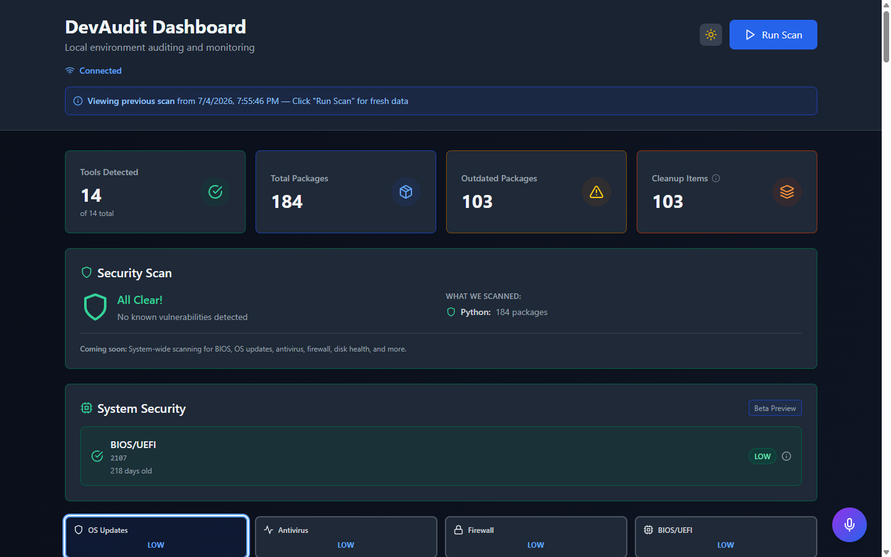
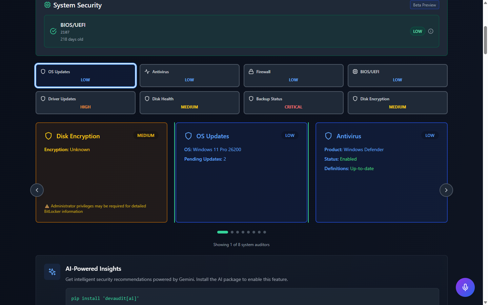

# 🔍 DevAudit

**Your Personal Security Assistant**

*Understand and protect your digital life through education and transparency.*

[](https://pypi.org/project/devaudit/)
[](https://opensource.org/licenses/MIT)

*The badge above reflects v0.1.0, the CLI-only release on PyPI. Everything else in this README, the dashboard, the system auditors, the education library, lives in this source tree and hasn't shipped to PyPI yet. See Version Status below.*

---

## 📌 Version Status

- **PyPI (`pip install devaudit`): v0.1.0.** Published November 2025. CLI-only: package and dependency auditing (Python, Node, Docker, Go). No dashboard, no system auditors, no AI insights.
- **This source tree: v0.3.x, unreleased.** Everything described in this README, the dashboard, 14 auditors, scan history, and the education library, is built and working here, but has never been tagged or published.
- **v0.4.0 will be the first full release**, adding hardware diagnostics and shipping everything above to PyPI.

Until then, install from source (see Quick Start) to get the current feature set.

---

## 🎯 What is DevAudit?

DevAudit started as a developer-focused package auditor and has grown into a personal security assistant that helps you understand your whole system, not just your dependencies.

**Beyond Packages** - it audits your BIOS, drivers, OS patches, antivirus, firewall, disk health, backups, and encryption, alongside the original package/dependency scanning.

**Education First** - findings don't just say "something is wrong". Each one explains what it is, why it matters, how to fix it, and when it's safe to ignore.

**Privacy By Default** - 100% local-first. All data stays on your machine. No telemetry, no cloud dependencies, no tracking.

**Our mission:** empower people to understand and protect their own systems, through education rather than gatekeeping. Honest risk ratings, not inflated scores. Never surveillance.

**Read More:**
- 🎯 [Use Cases](docs/USE_CASES.md) - How people use DevAudit
- 🗺️ [Roadmap](docs/ROADMAP.md) - What's coming next
- 🥧 [Raspberry Pi Guide](docs/RASPBERRY_PI.md) - Turn a Pi into a security hub
- 🔒 [Privacy Policy](docs/PRIVACY.md) · [Terms of Service](docs/TERMS.md)

---

## 🖼️ Screenshots

| Overview | System Auditors |
|---|---|
|  |  |

---

## ✨ Current Features (source tree, not yet on PyPI)

### Package & Dependency Auditors
- 🐍 **Python** - Packages, frameworks (Django, Flask, FastAPI), vulnerabilities (CVEs), outdated packages
- 🐍 **Python virtual environments** - Detection and per-venv dependency state
- 📦 **Node.js** - Global packages, frameworks (Express, React, Vue), npm audit integration
- 🐳 **Docker** - Containers, images, cleanup candidates, dangling resources
- 🔷 **Go** - Modules, dependencies, version tracking
- 💻 **System Tools** - Git, kubectl, Terraform, cloud CLIs

### System Auditors
- 🖥️ **BIOS/UEFI** - Version, update availability, security patch history
- 💿 **OS Updates** - Windows Update, macOS, Linux package manager status
- 🛡️ **Antivirus** - Windows Defender status, definition age
- 🔥 **Firewall** - Status, open ports, suspicious listening services
- 💾 **Disk Health** - SMART status, failure warnings
- 💼 **Backup** - Last backup, destination, verification status
- 🔐 **Encryption** - BitLocker, FileVault, LUKS status
- 🔌 **Drivers** - Outdated graphics/network/chipset drivers

### Interactive Web Dashboard
- 🌐 **Real-Time Monitoring** - WebSocket-powered live updates
- 📊 **Scan History** - Automatic tracking with timeline view
- 🔄 **Scan Comparison** - Side-by-side diff of any two scans
- 🛡️ **Security Scanning** - CVE detection with severity ratings
- ⚡ **One-Click Upgrades** - Select and upgrade outdated packages
- 🎨 **Dark mode, responsive design**, electric blue + emerald green
- ⌨️ **Keyboard Shortcuts** - `/` to search, `Ctrl+E` to export, `?` for help
- 🔒 **100% Private** - Runs on localhost, zero cloud dependencies

### Educational Content
- 📚 **Inline Explanations** - "What is this?" for every finding
- 💡 **Risk Context** - "Why does this matter?" with real examples
- 🛠️ **Fix Guidance** - Step-by-step remediation instructions
- 📖 **Documentation Library** - Guides in `docs/concepts/` for every auditor

### AI Insights (Optional, Off by Default)

DevAudit can generate plain-language insights on your scan results using Google Vertex AI (Gemini), plus a chat-based assistant. It's in the source tree, but it does nothing unless you turn it on.

```bash
pip install -e ".[ai]"
export DEVAUDIT_ENABLE_AI=1
export DEVAUDIT_VERTEX_PROJECT=your-gcp-project-id
devaudit serve
```

There is deliberately no default project. AI analysis runs against **your own** GCP project on **your own** billing, so a fresh install can't silently route scan data anywhere you didn't choose. Chat history stays in your browser's local storage. See [Privacy Policy](docs/PRIVACY.md) for exactly what leaves your machine when this is enabled.

---

## 🚀 Quick Start

### Installation

**From source (this is what the rest of this README describes):**
```bash
git clone https://github.com/Aramantos/devaudit.git
cd devaudit
pip install -e ".[server]"
```

**From PyPI (legacy, CLI-only):**
```bash
pip install devaudit
```
This installs v0.1.0: the original package/dependency auditor, no dashboard, no system auditors, no education library. A new PyPI release (v0.4.0) covering everything in this README is coming, see [Version Status](#-version-status).

### Three-Command Setup

```bash
# 1. Clone and install
git clone https://github.com/Aramantos/devaudit.git && cd devaudit
pip install -e ".[server]"

# 2. Start dashboard
devaudit serve

# 3. Open browser
# Visit: http://localhost:8888
```

**That's it!** Click "Run Scan" and explore your results.

### ⚠️ Antivirus Software Notice

DevAudit scans your system to check for security issues, which may trigger antivirus software warnings. This is normal behavior.

**If your antivirus flags DevAudit:**
1. **Verify the source** - Make sure you installed DevAudit from this repository or from PyPI
2. **Allow the process** - Click "Allow" when your antivirus asks about DevAudit
3. **Add an exception** (optional) - For smoother operation, add DevAudit to your antivirus exclusion list

**Why this happens:** DevAudit runs system commands (checking BIOS versions, scanning packages, reading system files) that antivirus software may flag as suspicious activity. This is expected for security auditing tools.

**Your privacy:** DevAudit runs 100% locally on your machine. No data is ever sent to external servers unless you explicitly enable AI Insights (above). See our [Privacy Policy](docs/PRIVACY.md) and [Terms of Service](docs/TERMS.md) for details.

---

## 📖 Core Commands

### `devaudit scan`

Audit your development environment.

```bash
# Full system scan
devaudit scan

# Specific tools
devaudit scan --python
devaudit scan --docker --node

# Project-specific
devaudit scan --target ~/projects/my-app

# Export as JSON
devaudit scan --format json > audit.json
```

**Options:**
- `--python`, `--node`, `--docker`, `--go`, `--system` - Audit specific tools
- `--target PATH` - Audit a specific project directory
- `--format {text,json,both}` - Output format
- `--no-reports` - Skip report files
- `--output-dir PATH` - Custom report directory

### `devaudit security`

Run the eight system security auditors (BIOS, OS updates, antivirus, firewall, drivers, disk health, backups, encryption) straight from the terminal. Same auditors as the dashboard, no web UI needed.

```bash
# Risk-sorted table with recommendations
devaudit security

# JSON output (for scripts or scheduled runs)
devaudit security --format json

# Save a JSON report
devaudit security --output-dir ./reports
```

Runs fine without admin rights. Where elevation would unlock more detail (SMART counters, BitLocker status), the result says so honestly instead of guessing.

### `devaudit serve`

Launch the web dashboard.

```bash
# Default (localhost:8888)
devaudit serve

# Custom port
devaudit serve --port 3000

# Network access (Raspberry Pi, etc.)
devaudit serve --host 0.0.0.0 --port 8888
```

### `devaudit fix-docker`

Fix Docker Desktop issues (Windows only).

```bash
devaudit fix-docker
```

---

## 🌐 Web Dashboard

**Privacy-First Monitoring**

The dashboard runs 100% locally, no data ever leaves your machine unless you opt in to AI Insights.

### Key Features

#### Overview & Insights
- **Tools Detected** - Click to see all installed development tools
- **Total Packages** - Searchable, sortable table of all dependencies
- **Outdated Packages** - One-click upgrade with checkbox selection
- **Cleanup Items** - Detailed breakdown (outdated packages, vulnerabilities, Docker cleanup)
- **Security Scan** - CVE detection with severity levels and fix recommendations
- **System Health** - BIOS, OS updates, antivirus, firewall, disk health, backup, encryption, drivers

#### History & Comparison
- **Automatic Tracking** - Every scan saved to `~/.devaudit/history/`
- **Timeline View** - See scans over time with relative timestamps
- **Trend Indicators** - Visual arrows showing security posture (improving ↓ or degrading ↑)
- **Side-by-Side Comparison** - Compare any two scans to see exact changes
- **Scan Notes** - Annotate scans ("before upgrade", "production baseline")

#### Productivity
- **Export Scan History** - Download as JSON or CSV
- **Search & Filter** - Real-time search across all scans
- **Keyboard Shortcuts** - Navigate faster with keyboard
  - `/` or `Ctrl+K` - Focus search
  - `Ctrl+E` - Export JSON
  - `Ctrl+Shift+E` - Export CSV
  - `?` - Show all shortcuts

#### User Experience
- **Dark Mode** - Default dark theme with toggle
- **Responsive Design** - Works on desktop, tablet, and mobile
- **Skeleton Loading** - Loading states while a scan runs
- **Educational Tooltips** - Learn about every metric

### Dashboard Modes

**🟢 Local Mode (FREE - Current)**
- Runs on localhost (127.0.0.1)
- 100% private, data never leaves your machine
- No internet required
- Free forever

**🔵 Ephemeral Cloud Mode (Planned, v1.0+)**
- Remote access from anywhere
- Real-time streaming only (no storage)
- End-to-end encrypted tunnel
- ~$5/month

**🟣 Encrypted Cloud Mode (Planned, v1.0+)**
- Historical scan storage (E2E encrypted)
- You hold the encryption keys
- Cross-device sync
- ~$10/month

Neither cloud mode exists yet. See [docs/ROADMAP.md](docs/ROADMAP.md).

---

## 🎯 Use Cases

### 1. Personal Laptop Security
Keep your system secure without hiring an IT consultant.

```bash
pip install -e ".[server]"
devaudit serve
# Click "Run Scan" → See security issues → Fix them
```

**Perfect for:** Non-technical users, privacy advocates, security-conscious individuals

### 2. Developer Environment Monitoring
Track vulnerabilities and outdated dependencies across projects.

```bash
# Audit your project
cd ~/projects/my-app
devaudit scan --format json

# Integrate with CI/CD
devaudit scan --format json | jq '.summary.vulnerabilities'
```

**Perfect for:** Full-stack developers, DevOps engineers, open source maintainers

### 3. Home Lab Multi-Device Management
Monitor all your computers from one dashboard (planned - see [docs/ROADMAP.md](docs/ROADMAP.md)).

```bash
# Install on Raspberry Pi (from source, today)
git clone https://github.com/Aramantos/devaudit.git && cd devaudit
pip3 install -e ".[server]"
devaudit serve --host 0.0.0.0

# Access from any device: http://raspberrypi.local:8888
```

**Perfect for:** Tech enthusiasts, home lab operators, multi-device users

### 4. Raspberry Pi Security Hub
Turn a Raspberry Pi into an always-on security monitoring hub.

**See:** [Complete Raspberry Pi Setup Guide](docs/RASPBERRY_PI.md)

**Perfect for:** DIY enthusiasts, privacy-focused families, learning projects

### 5. Family Computer Maintenance
Proactively maintain family devices (with consent).

**Perfect for:** Tech-savvy family members, adult children helping parents

⚠️ **Important:** DevAudit will NEVER build surveillance features. All monitoring requires explicit consent and transparency.

**More use cases:** See [docs/USE_CASES.md](docs/USE_CASES.md)

---

## 🛠️ What Gets Audited

### Built (source tree, v0.3.x, not yet on PyPI)

**Package & Dependency Auditors (6):**
- Python packages, frameworks, vulnerabilities, virtual environments
- Node.js packages, frameworks, npm audit
- Docker containers, images, cleanup candidates
- Go modules and dependencies
- System tools (Git, kubectl, Terraform, cloud CLIs)

**System Auditors (8):**
- 🖥️ **BIOS/UEFI** - Version, updates, security patches
- 💿 **Operating System** - Windows Update, macOS patches, Linux updates
- 🛡️ **Antivirus** - Windows Defender status, definition age
- 🔌 **Drivers** - Graphics, network, chipset updates
- 💾 **Disk Health** - SMART status, failure warnings
- 💼 **Backup Status** - Last backup, destination, integrity
- 🔐 **Encryption** - BitLocker, FileVault, LUKS status
- 🔥 **Firewall** - Status, open ports, suspicious services

**Educational Library:**
- "What is X?" guides for every auditor in `docs/concepts/`
- "Why does X matter?" explanations
- Step-by-step fix instructions

### In Development (v0.4.0): Hardware Diagnostics

Harvest-only auditors that read the diagnostic signals your hardware already emits, and teach you how to read them:

- 💾 **SMART / storage health** - the drive's own reliability counters
- ⚠️ **Windows hardware error log (WHEA)** - CPU, memory, and PCIe error events
- 🔌 **Disk/controller I/O event log** - interface and transport errors
- 🧠 **RAM diagnostic results** - Windows Memory Diagnostic / memtest output
- 🩺 **Device problem states** - Device Manager error codes

The point is fault isolation, not just alerting. For example: rising interface/CRC errors with flat reallocated-sector counts points at a bad cable or enclosure, not a failing drive, and the auditor explains why. A later phase adds a synthesis verdict across signals and periodic scheduled scans.

**See:** [Full Roadmap](docs/ROADMAP.md)

---

## 🔒 Privacy Commitment

**DevAudit is privacy-first by design:**

✅ **Local-First** - All scans run on YOUR machine
✅ **Zero Telemetry** - We never collect usage data
✅ **No Cloud Dependencies** - Works 100% offline
✅ **You Own Your Data** - Scan history stored locally on YOUR filesystem
✅ **Open Source** - Audit our code anytime (MIT License)
✅ **AI is opt-in** - Off by default, runs against your own GCP project when enabled

**Future Cloud Modes (planned, not built):**
- Opt-in only (local mode always free)
- Zero-knowledge encryption (we can't read your data)
- You hold the keys
- Cancel anytime, full local mode restored

**See:** [Privacy Policy](docs/PRIVACY.md)

---

## 🗺️ Roadmap

| Stage | What | Where |
|-------|------|-------|
| **Shipped** | CLI package/dependency auditor (v0.1.0) | Live today via `pip install devaudit` |
| **Built, unreleased** | Dashboard, 14 auditors, scan history/comparison/trends, education library, optional AI insights | This repo, install from source |
| **In development** | **v0.4.0** - Hardware diagnostics (SMART, WHEA, disk/controller I/O log, RAM diagnostics, device problem states) plus the first full PyPI release of everything above |, |

Everything past v0.4.0 (remediation engine, multi-device support, automation, cloud tiers) is planned but not date-scheduled, it ships when the stage before it proves useful in real use, not on a calendar.

**Read More:** [Complete Roadmap](docs/ROADMAP.md)

---

## 💡 Example Workflows

### Keep Your Laptop Secure

```bash
# Run weekly scan
devaudit serve
# Click "Run Scan" → Review findings → Apply fixes
```

### Monitor Project Dependencies

```bash
# Check for vulnerabilities before deployment
cd ~/projects/production-app
devaudit scan --format json > pre-deploy-audit.json

# Review vulnerabilities
cat pre-deploy-audit.json | jq '.vulnerabilities'
```

### Raspberry Pi Home Hub

```bash
# On Raspberry Pi, from source
git clone https://github.com/Aramantos/devaudit.git && cd devaudit
pip3 install -e ".[server]"
devaudit serve --host 0.0.0.0

# Access from phone/tablet/laptop
# http://raspberrypi.local:8888
```

### CI/CD Integration

```yaml
# GitHub Actions
- name: Security Audit
  run: |
    pip install devaudit
    devaudit scan --format json
    # Fail if critical vulnerabilities found
    CRITICAL=$(jq '[.vulnerabilities[] | select(.severity=="CRITICAL")] | length' audit.json)
    if [ "$CRITICAL" -gt 0 ]; then exit 1; fi
```
This example uses the current PyPI release (v0.1.0, CLI-only) since it's all a CI pipeline needs.

---

## 📚 Documentation

- **🎯 [Use Cases](docs/USE_CASES.md)** - Detailed deployment scenarios and examples
- **🥧 [Raspberry Pi Guide](docs/RASPBERRY_PI.md)** - Complete step-by-step Pi setup
- **🗺️ [Roadmap](docs/ROADMAP.md)** - Detailed feature roadmap
- **🔒 [Privacy Policy](docs/PRIVACY.md)** and **[Terms of Service](docs/TERMS.md)**
- **🛠️ [Contributing](docs/CONTRIBUTING.md)** - How to contribute

---

## 📦 Requirements

**Core CLI:**
- Python 3.10+
- Cross-platform (Windows, macOS, Linux)

**Web Dashboard (optional):**
- FastAPI 0.104.0+
- uvicorn 0.24.0+
- websockets 12.0+
- Install with: `pip install -e ".[server]"`

**AI Insights (optional):**
- google-cloud-aiplatform, your own GCP project
- Install with: `pip install -e ".[ai]"`

**Tools to Audit (optional):**
- Python, Node.js, Docker, Go (only if you want to audit them)

---

## 🤝 Contributing

We welcome contributions! DevAudit is open source (MIT License) and community-driven.

**Ways to contribute:**
- 🐛 Report bugs and suggest features
- 📚 Improve documentation
- 🔧 Submit code contributions
- 💬 Answer questions and help others
- ⭐ Star the repo to show support

**See:** [docs/CONTRIBUTING.md](docs/CONTRIBUTING.md)

---

## 📄 License

MIT License - See [LICENSE](LICENSE) file for details.

Free to use, modify, and distribute. No restrictions.

---

## 🙏 Acknowledgments

- Terminal UI powered by [Rich](https://github.com/Textualize/rich)
- CLI framework by [Click](https://click.palletsprojects.com/)
- Dashboard built with [Next.js](https://nextjs.org/) and [FastAPI](https://fastapi.tiangolo.com/)
- Inspired by the need for honest, educational security tools

---

## 📞 Support & Community

- **GitHub Issues:** [Report bugs or request features](https://github.com/Aramantos/devaudit/issues)
- **GitHub Discussions:** [Ask questions, share ideas](https://github.com/Aramantos/devaudit/discussions)
- **Email:** john.doyle.mail@icloud.com

---

## ⭐ Show Your Support

If DevAudit helps you stay secure, please:
- ⭐ **Star the repository** on GitHub
- 🐦 **Share it** with friends and colleagues
- 📝 **Write about it** on your blog or social media
- 🤝 **Contribute** code, docs, or ideas

---

**DevAudit** - *Understanding your environment is the first step to protecting it.* 🔍
